# Intro
Before starting the class, you need to prepare your computer to match the learning environment. We use Linux (debian), you can't use Windows with WSL yet because it's still beta, and if you don't know what you're doing, you will cause a lot of problems

----------
# Download
### Linux
There are mainly three Linux variants that you can install
1. [Ubuntu](https://ubuntu.com/#download)
   
   Choose the LTS version & download this if your RAM is more than 8GB
2. [Ubuntu Mate](https://ubuntu-mate.org/download/)
   
   Choose the 64-bit version if your RAM is less than 8GB, or choose the 32-bit version if your RAM is equal or less than 2GB
3. [Elementary OS](https://elementary.io/)

   Use this if you have more than 8GB and a fancy processor, the interface is clean and easy to work with, make sure you choose custom price and fill it with $0 to make it free to download
4. [Linux Mint](https://www.linuxmint.com/download.php)
   
   Choose the Cinnamon version & use this if your have RAM more than 8GB, but you afraid about the interface differencies between Windows
----------
### Bootable flash drive
After downloading your desired Linux, it's time to install [Rufus](https://rufus.ie/), after download & install, follow these steps
- Insert a flash drive, make sure that this flash drive is format-able, means there's nothing importaint in it
- Open Rufus
- Choose Flash Drive
- Choose your flash drive
  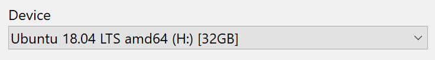
- Choose your Linux .iso file
  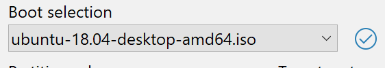
- Choose MBR Partition Scheme
  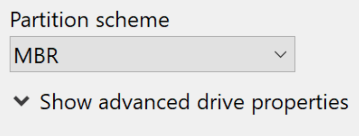
- Choose FAT32/FAT file system
  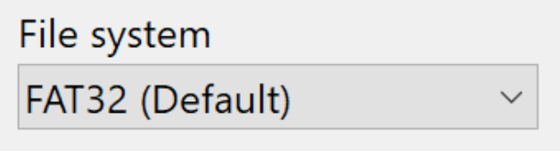
- Press start!
----------
# Installation
## Set up partition
- 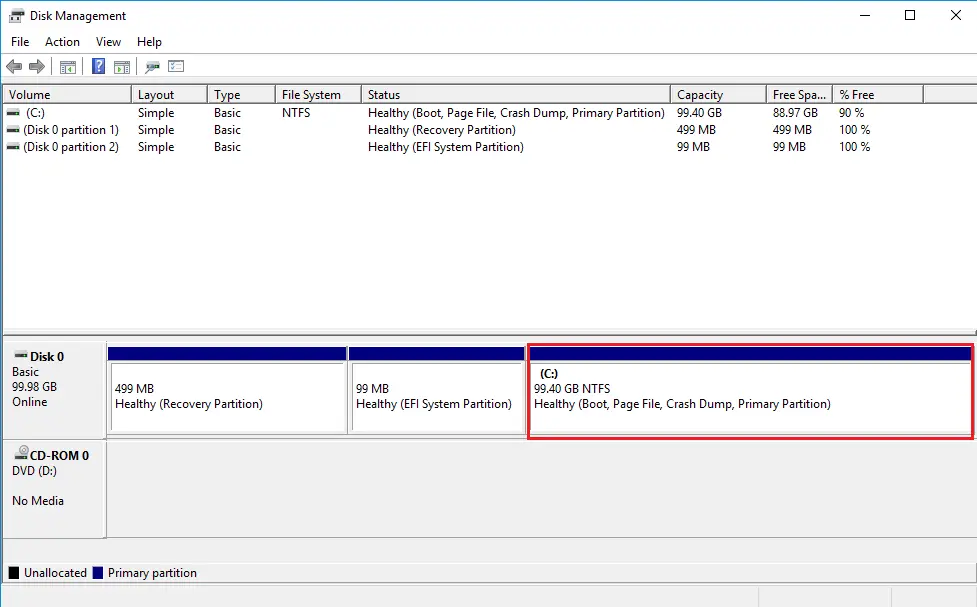
  In Windows, press `Win + R` then type `diskmgmt.msc` to open Disk Management Utility
- 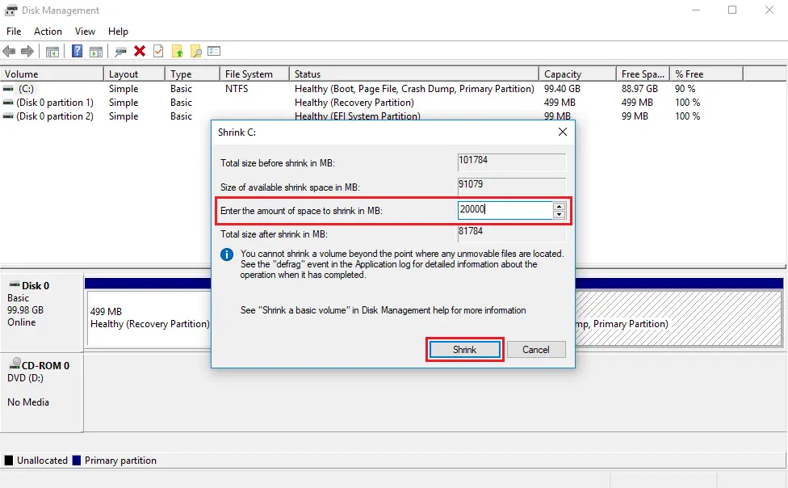
  Shrink one of your drive by right click on your desired drive and then select `Shrink Volume` to resize the partition. Enter the amount in MB and then click Shrink to begin the shrinking operation.
- 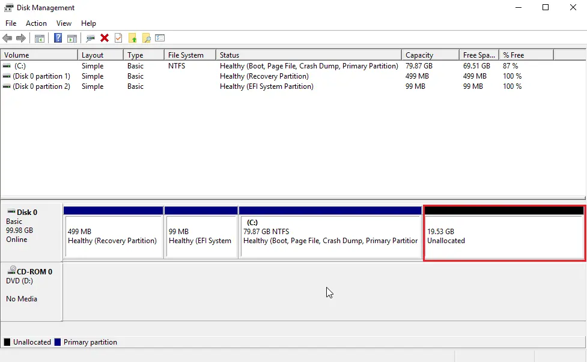
  Leave it Unallocated, now let's install Linux
----------
## Boot to your flash drive
- Restart your PC / Laptop and go to BIOS (press `F2` / `F10` / `F12` while the computer boot, or consult your computer model by googling it about how to go to BIOS)
- Now your task is to find something that's called "Boot order," usually its inside the "Advanced" tab
- Change your USB Flash drive Boot Priority to the top
- Find "Save and restart" or any alike words, and `enter`
----------
## Installing Linux
- 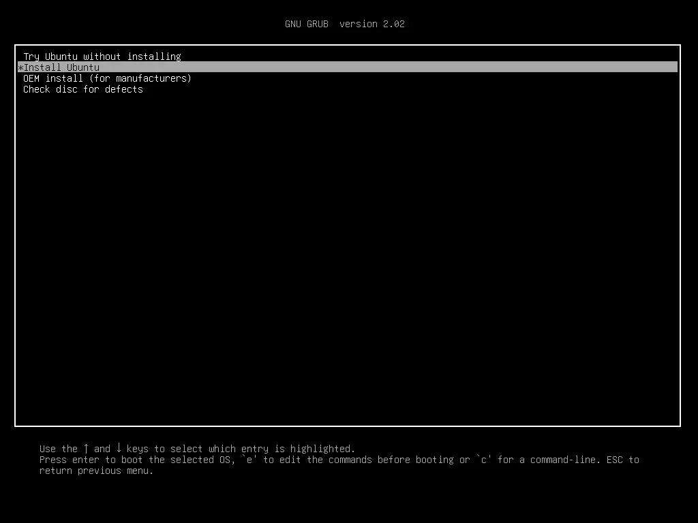
  Choose install Ubuntu or your downloaded Linux
- 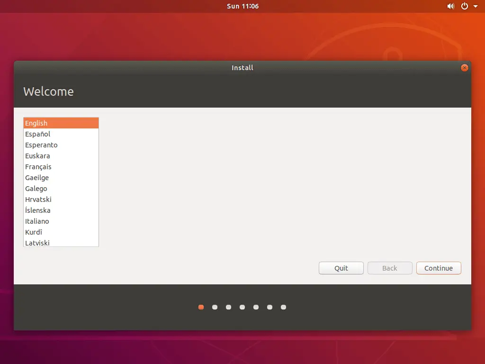
  Choose english (indonesian transalation is bad)
- 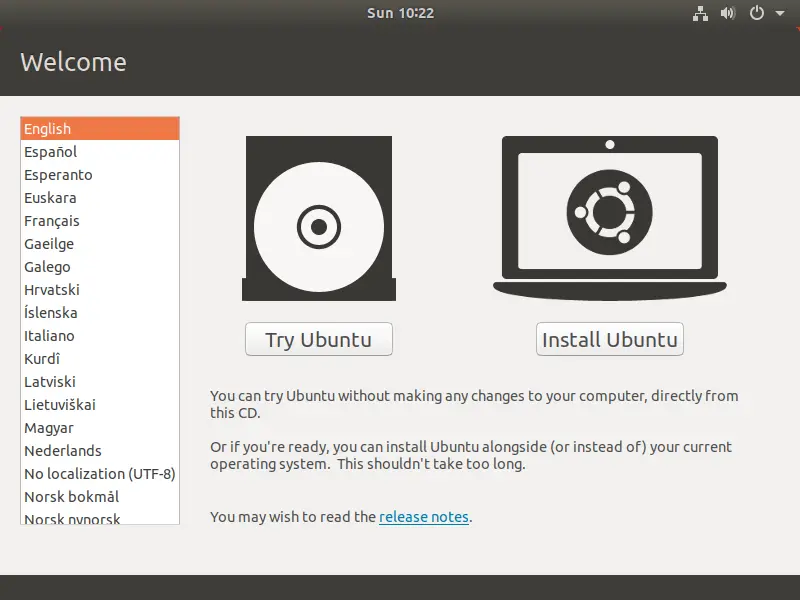
  Choose install Ubuntu
- Keep pressing continue
- 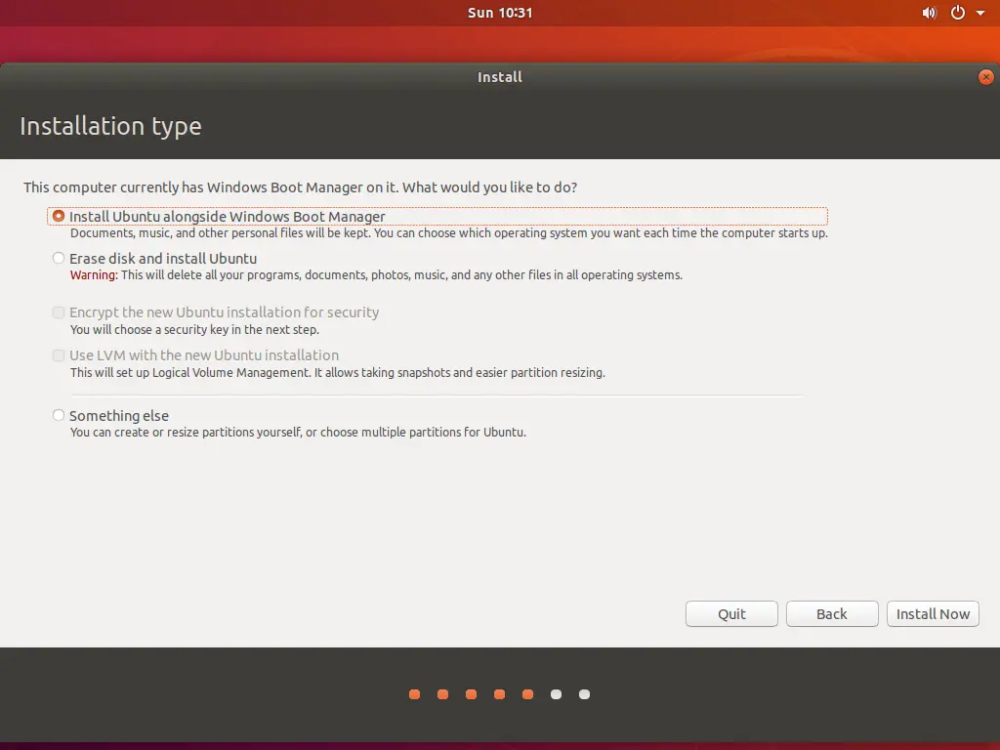
  If you see a page called "Installation Page", please choose
    - `Install Ubuntu alongside Windows Boot Manager` for dual boot
    - `Erase disk and install Ubuntu` to fully using Ubuntu (All of your data will be erased, if you haven't back up your data, please restart your laptop and go back to Windows by long pressing the power button and unplugging your flash drive before the computer boots)
- 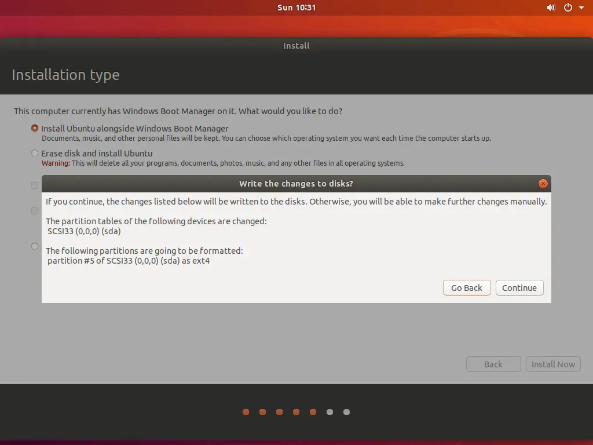
  Click `Continue`
- Continue and wait until finished, at boot, your computer will ask what OS do you want to boot or it will go straight to Ubuntu when you choose `Erase disk and install Ubuntu`
- After you finished install, and the Ubuntu restarts, **plug out your flash drive!**